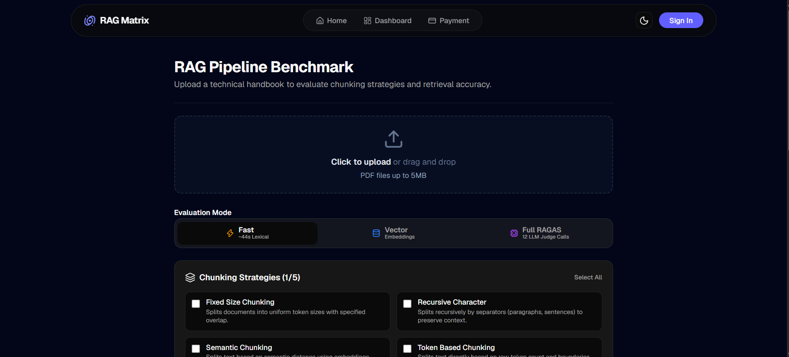

<div align="center">


<br />


<br />

<p>
  <b>Full Stack Developer focused on backend engineering, scalable architecture,<br/>
  clean systems and turning ideas into production-ready software.</b>
</p>

<br />

<a href="https://github.com/SumitChauhan-co">

</a>
 
<a href="https://linkedin.com/in/sumit-chauhan-10679a384">

</a>
 
<a href="https://twitter.com/SUMITCH433">

</a>
 
<a href="mailto:[chauhan.sumit3012@gmail.com](mailto:chauhan.sumit3012@gmail.com)">

</a>

<br/><br/>


</div>

---

# `01` — 🚀 About Me

### 👋 Hi, I'm Sumit
**Full Stack Developer | Backend & System Design Enthusiast**

> **Build • Understand • Optimize • Scale**

I build software from the ground up—from **responsive interfaces and secure APIs to scalable databases and deployment infrastructure**. While I work confidently across the entire stack, my core passion lies in backend engineering, distributed systems, and robust architecture.

---

### 💻 Technical Focus & Core Values

* ⚙️ **Backend Engineering** — Clean API design, optimized databases, service architecture, and high performance.
* 🧠 **System Design** — Designing for scalability, reliability, distributed architectures, and fault tolerance.
* ☁️ **Infrastructure & DevOps** — Containerization with Docker, Linux administration, CI/CD pipelines, and cloud deployments.
* 🤖 **AI Engineering** — LLM application development, RAG systems, AI integrations, and intelligent automation.
* 🔐 **Security & Auth** — Implementing OAuth 2.0, OpenID Connect, JWTs, and secure-by-default application flows.
* 🎨 **Frontend Engineering** — Building with React, TypeScript, state management, and responsive interfaces.
* 🚀 **Product Engineering** — Shipping complete, production-ready products rather than isolated demos.

---

# `02` — 🛠️ Technology

### 💻 Languages

<p align="left">

<a href="https://www.cprogramming.com/"></a>
 
<a href="https://isocpp.org/"></a>
 
<a href="https://www.java.com/"></a>
 
<a href="https://developer.mozilla.org/en-US/docs/Web/JavaScript"></a>
 
<a href="https://www.typescriptlang.org/"></a>
 
<a href="https://www.python.org/"></a>

</p>

### 🎨 Frontend

<p align="left">

<a href="https://react.dev/"></a>
 
<a href="https://nextjs.org/"></a>
 
<a href="https://tailwindcss.com/"></a>
 
<a href="https://redux.js.org/"></a>
 
<a href="https://vite.dev/"></a>
 
<a href="https://www.framer.com/motion/"></a>
 
<a href="https://reactnative.dev/"></a>
 
<a href="https://getbootstrap.com/"></a>

</p>

### ⚙️ Backend & APIs

<p align="left">

<a href="https://nodejs.org/"></a>
 
<a href="https://expressjs.com/"></a>
 
<a href="https://fastapi.tiangolo.com/"></a>
 
<a href="https://appwrite.io/"></a>
 
<a href="https://graphql.org/"></a>

</p>

### 🗄️ Databases & Data

<p align="left">

<a href="https://www.mongodb.com/"></a>
 
<a href="https://www.postgresql.org/"></a>
 
<a href="https://www.mysql.com/"></a>
 
<a href="https://redis.io/"></a>

</p>

### ☁️ DevOps & Infrastructure

<p align="left">

<a href="https://www.docker.com/"></a>
 
<a href="https://www.linux.org/"></a>
 
<a href="https://kubernetes.io/"></a>
 
<a href="https://nginx.org/"></a>
 
<a href="https://github.com/features/actions"></a>
 
<a href="https://vercel.com/"></a>
 
<a href="https://render.com/"></a>

</p>

### 🔐 Authentication & Security

<p align="left">


 

 


</p>

### 🤖 AI Integration & Services

<p align="left">
   &nbsp;&nbsp; 
   &nbsp;&nbsp; 
   &nbsp;&nbsp; 
   &nbsp;&nbsp; 
  
</p>

### 🔧 Developer Tools

<p align="left">

<a href="https://git-scm.com/"></a>
 
<a href="https://github.com/"></a>
 
<a href="https://code.visualstudio.com/"></a>
 
<a href="https://www.gnu.org/software/bash/"></a>
 
<a href="https://www.postman.com/"></a>
 
<a href="https://www.figma.com/"></a>
 
<a href="https://kafka.apache.org/"></a>

</p>

---

# `03` — ✨ Featured Work

<p align="center">
  <b>Things I've actually built, deployed and learned from.</b>
</p>

<br />

<!-- LOCUS -->

<div align="center">

<a href="https://locus-space.vercel.app/">

</a>

<br/><br/>

<h2>🌐 Locus</h2>

<p>
<b>Location-aware social platform engineered around discovery, interaction and geospatial data.</b>
</p>

<p>


</p>

</div>

### What makes it interesting

```text
⚡ Live Location
   └── GPS updates with continuously refreshed user positioning

🔐 Secure Application Flow
   └── Authentication, protected routes and token handling

🚦 API Protection
   └── Rate limiting and controlled backend access
```

<div align="center">

<a href="https://locus-space.vercel.app/">

</a>
 
<a href="https://github.com/SumitChauhan-co/locus">

</a>

</div>

<br/>

---

<!-- PROTOAUTH -->

<div align="center">

<a href="https://protoauth.vercel.app/">

</a>

<br/><br/>

<h2>🔐 ProtoAuth</h2>

<p>
<b>Custom authentication infrastructure implementing modern OAuth 2.0 and OpenID Connect concepts.</b>
</p>

<p>


</p>

</div>

### What makes it interesting

```text
🔑 OAuth 2.0
   └── Authorization flow implementation

🪪 OpenID Connect
   └── Identity layer built over OAuth concepts

🎟️ Authorization Codes
   └── Server-side authorization code lifecycle

🔒 Token Architecture
   └── Secure token-based authentication

🗄️ Persistent Storage
   └── PostgreSQL-backed identity infrastructure

🐳 Containerized Backend
   └── Docker-based deployment workflow
```

<div align="center">

<a href="https://protoauth.vercel.app/">

</a>
 
<a href="https://github.com/SumitChauhan-co/protoAuth">

</a>

</div>

<br/>

---

<!-- CHOICELY -->

<div align="center">

<a href="https://choicely-real.vercel.app/">

</a>

<br/><br/>

<h2>🗳️ Choicely</h2>

<p>
<b>Interactive live polling platform combining real-time participation with visual analytics.</b>
</p>

<p>


</p>

</div>

### What makes it interesting

```text
📊 Live Polling
   └── Interactive voting and result updates

📈 Analytics
   └── Visual representation of polling data

🧩 Dynamic Configuration
   └── Flexible poll creation and setup

🔐 Authentication
   └── Protected application workflows

🗄️ Persistent Data
   └── Backend-backed poll and user state

🎨 Responsive Interface
   └── Designed for desktop and mobile interaction
```

<div align="center">

<a href="https://choicely-real.vercel.app/">

</a>
 
<a href="https://github.com/SumitChauhan-co/choicely">

</a>

---
<!-- RAG Matrix -->

<div align="center">

<a href="https://project-exhibition-delta.vercel.app/">
  
</a>

<br/><br/>

<h1>🧠 RAG Matrix</h1>

<p>
  <b>Automated evaluation and benchmarking for Retrieval-Augmented Generation systems.</b>
</p>

<p>
  Measure how your RAG pipeline performs across
  <b>context recall</b>, <b>faithfulness</b>, <b>latency</b>, and
  <b>LLM evaluation metrics</b>.
</p>

<br/>

<p>
  
  
  
  
  
  
  
</p>

</div>

<br/>

## ⚡ What makes RAG Matrix interesting

```text
🧪 Automated RAG Evaluation
   └── Evaluate generated answers against retrieved context
       using measurable quality metrics.

📊 Multi-Dimensional Benchmarking
   └── Compare context recall, faithfulness, latency,
       and other evaluation signals across executions.

🤖 Multi-LLM Evaluation
   └── Run the same evaluation workflow across different
       models and providers for meaningful comparison.

📈 Evaluation Analytics
   └── Turn raw evaluation results into readable metrics,
       trends, and visual comparisons.

⚙️ Async Execution
   └── Long-running evaluations execute independently
       while the interface tracks their progress.

🔔 Real-Time Notifications
   └── Get notified when an evaluation completes,
       including browser and mobile notification support.
```

<br/>

<div align="center">

<a href="https://project-exhibition-delta.vercel.app/">
  
</a>

 

<a href="https://github.com/SumitChauhan-co/project-exhibition">
  
</a>

</div>

<br/>

<div align="center">

<sub>
Built for developers who want to <b>measure</b> their RAG systems instead of guessing how well they perform.
</sub>

</div>


---

# `04` — 📊 GitHub Analytics

<div align="center">


</div>

<br/>

<div align="center">


</div>

---

# `05` — 🐍 Contribution Graph

<div align="center">


</div>

---

# `06` — 🧩 Engineering Philosophy

<div align="center">

## **Build. Understand. Improve.**

> **Discipline over motivation.**
>
> Build consistently.
> Ship real products.
> Understand the systems underneath.
> Improve relentlessly.

</div>

---

# `07` — 💬 Let's Connect

<div align="center">

I'm always interested in **building software, exploring new technologies and collaborating on meaningful projects.**

<br/>

<a href="mailto:[chauhan.sumit3012@gmail.com](mailto:chauhan.sumit3012@gmail.com)">

</a>
 
<a href="https://linkedin.com/in/sumit-chauhan-10679a384">

</a>
 
<a href="https://twitter.com/SUMITCH433">

</a>
 
<a href="https://github.com/SumitChauhan-co">

</a>

<br/><br/>

### ⚡ Building the next system, one commit at a time.

<br/>


</div>
