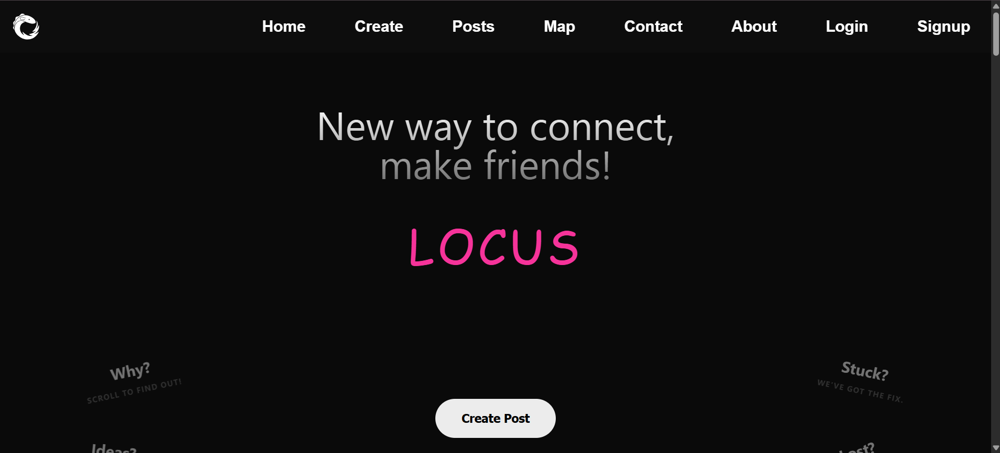
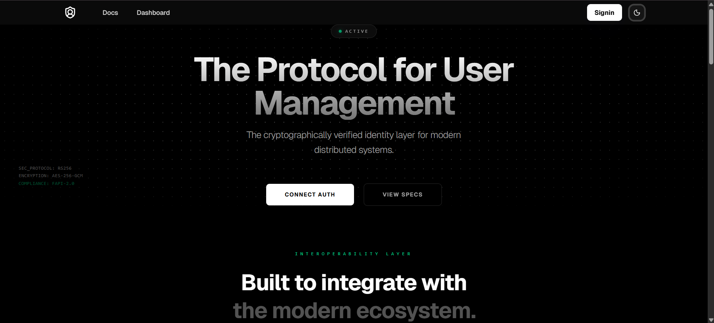
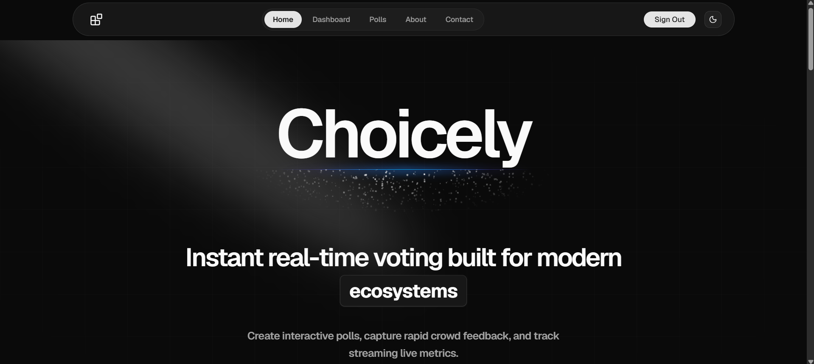

# 👋 Hi, I'm Sumit Chauhan

### Building scalable, production-ready applications with a focus on backend engineering, clean architecture, and exceptional user experiences.

---

# 🚀 About Me

I'm a **Full Stack Developer** passionate about transforming ideas into scalable software.

I enjoy designing backend architectures, crafting intuitive user interfaces, and solving complex engineering problems through clean, maintainable code.

Currently exploring **System Design**, **DevOps**, **Cloud**, and **Generative AI** while continuously building real-world applications.

---

# 🎯 Current Focus

- ⚙️ Backend Engineering
- 🏗️ System Design
- ☁️ DevOps & Docker
- 🤖 AI Integration
- 📚 Data Structures & Algorithms
- 🚀 Building Production Ready Applications

---

# 🛠 Tech Stack

### Languages

### Frontend

### Backend

### Database

### DevOps & Cloud

### Tools

---

# 🚀 Featured Projects

<table>
<tr>
<td width="50%" valign="top">

### 🌐 Locus
Modern social media platform.

</td>

<td width="50%" valign="top">

### 🔐 ProtoAuth
Authentication infrastructure.

</td>
</tr>

<tr>

<td width="50%" valign="top">

### 🗳️ Choicely
Interactive polling platform.

</td>
</tr>
</table>

# 📊 GitHub Analytics

  

---

# 📈 Contribution Graph

---

# 💭 Engineering Philosophy

> Discipline over motivation.
> 
> Build consistently. Ship real products. Improve relentlessly.
---

# 📫 Let's Connect

---
